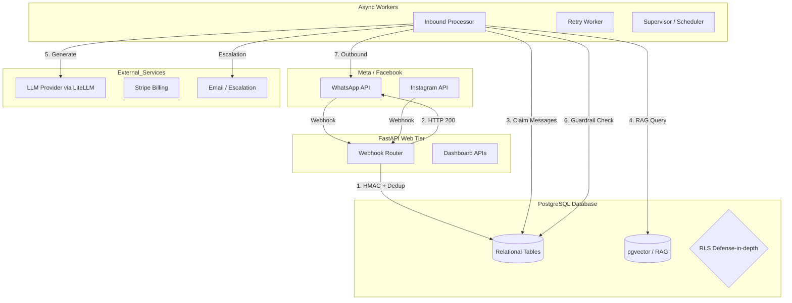

# Architecture Discovery Audit
**Phase:** 01
**Role:** Principal Architect
**Date:** 2026-08-21

This document represents the current mental model of the system architecture, built by auditing the source code and configuration files. It distinguishes between what has been definitively verified in code, what is inferred from dependencies/structure, and what remains unverified.

---

## 1. System Overview

The system is a multi-tenant B2B SaaS that provides automated, AI-driven conversational agents over WhatsApp and Instagram. It handles incoming messages via webhooks, performs semantic context retrieval (RAG), classifies intents, generates AI responses, applies deterministic safety guardrails, and manages external side effects like bookings and human escalation.

### 1.1 Verified Subsystems

*   **API Gateway / Webhooks (FastAPI)**: Handles incoming webhooks from Meta (WhatsApp/Instagram) and Stripe. Employs fast-acknowledgment (HTTP 200), HMAC validation, timestamp replay protection, payload size limits, and idempotency checks (`dedup_check`).
*   **Asynchronous Workers**: Separates webhook reception from LLM generation. `InboundProcessor` pulls messages with `status='received_pending_ai'`, processes them, and dispatches outbound messages.
*   **Database (PostgreSQL + asyncpg)**: Acts as the central state store. Uses `pgvector` for RAG document chunk embeddings.
*   **Tenant Isolation Model**: Logical multi-tenancy. The backend application connects to the DB using a `service_role` key, which **bypasses Row-Level Security (RLS)**. Therefore, tenant isolation is strictly enforced at the application level via `organization_id` WHERE clauses. RLS policies exist in the database schema (`008_rls_hardening.sql`) purely as a defense-in-depth measure against direct DB attacks or future client-side queries.
*   **RAG & FAQ Cache**: Employs semantic caching (`faq_cache.py`) to bypass the LLM for repeated questions, reducing cost and latency. `pgvector` stores document chunks in `document_chunks`.
*   **Guardrails Pipeline**: Post-generation deterministic checks (`valida_risposta`, `applica_guardrail`). LLM output cannot directly trigger side effects without this validation phase blocking policy violations.
*   **Consent Management**: Opt-out is fail-closed. If an opt-out intent is detected, it logs to `contact_consent_log`, fires a security audit event, and suppresses outbound marketing.
*   **Billing & Usage Governance**: Every LLM call triggers a `record_usage` event in the DB. `is_org_suspended` acts as a hard kill switch preventing further AI generation if a tenant exceeds budget or trial limits.

### 1.2 Inferred Subsystems

*   **Background Jobs & Scheduling**: Inferred from `APScheduler` in `requirements.txt`, `run_retry_worker.py`, and `run_supervisor.py`. Likely handles message delivery retries, appointment reminders, and SLA escalations.
*   **Frontend**: Inferred from `web/` directory containing `app.js`, HTML files, and `nginx.conf`. It likely serves as the B2B dashboard for organization configuration and analytics.
*   **Authentication Flow**: Inferred from `src.core.auth` (JWT issuer, MFA mentions). The backend seems to validate JWTs issued by a Supabase-like identity provider or custom issuer.

### 1.3 Unverified

*   **Load Balancing & Deployment Topology**: Dockerfiles and docker-compose exist, but production scaling strategy (e.g., Kubernetes, ECS) and how workers scale concurrently without race conditions on `claim_inbound_messages` (assuming `SKIP LOCKED` is used, but needs explicit verification).
*   **Exact LLM Providers**: `crewai[litellm]` is present, suggesting a multi-model routing capability, but the exact default model (GPT-4, Claude 3, etc.) is hidden behind the abstraction.

---

## 2. A. System Diagram

---

## 3. B. Critical Data Flows

### Inbound Message Flow (WhatsApp)
1. **Ingestion**: Payload arrives at `/webhooks/whatsapp`.
2. **Security**: HMAC signature checked against `App Secret`. Payload size capped. Optional timestamp check.
3. **Idempotency**: `dedup_check` verifies if `wam_id` was already processed.
4. **Persistence**: Message written to `messages` table with `status = 'received_pending_ai'` inside an `asyncpg` transaction.
5. **Processing**: `InboundProcessor` claims the message.
6. **Intent Classification**: LLM (or heuristics) classifies intent.
7. **Semantic Cache**: If FAQ, searches `faq_cache` via embedding. If hit -> jump to step 10.
8. **RAG Context**: `recupera_contesto_documenti` pulls tenant-specific data from `document_chunks`.
9. **AI Generation**: `genera_risposta_async` calls LLM.
10. **Guardrails**: Output parsed deterministically. If policy violated -> Block or censor.
11. **Side Effects**: E.g., `booking_service.create_booking()`.
12. **Outbound**: Payload sent to Meta API; `record_usage` tracks token costs.

---

## 4. C. Critical Invariants (Verified in Architecture)

1. **Service Role Authorization**: Because the backend uses `service_role` (bypassing RLS), every database query MUST include `organization_id` at the application level.
2. **Decoupled Webhooks**: Webhooks NEVER wait for LLM I/O. They strictly validate and persist.
3. **Fail-Closed AI**: LLM outputs do not have direct DB write permissions. They output structured requests that are validated by the Python application (`valida_risposta`).
4. **Atomic Deduping**: `dedup_check` ensures that transient network failures causing Meta to resend webhooks do not result in duplicate LLM calls or duplicate customer responses.
5. **Cost Kill-Switch**: Subscriptions are verified before AI generation; suspended orgs receive a static fallback message to halt LLM token burn.

---

## 5. D. Unknowns Requiring Investigation

1. **Worker Concurrency Model**: How does `claim_inbound_messages` prevent two workers from picking up the same message? Does it use `SELECT ... FOR UPDATE SKIP LOCKED`?
2. **Dead Letter Queue (DLQ)**: If a message repeatedly crashes the `InboundProcessor`, how is it quarantined? (Migration `010_dead_letter.sql` exists, but the exact retry/DLQ mechanism needs code-level review).
3. **LLM Fallback Strategy**: If the primary LLM provider (e.g., OpenAI) is down, does `LiteLLM` automatically route to a fallback (e.g., Anthropic)?
4. **PII Scrubbing**: Are phone numbers and customer names scrubbed before being sent to the LLM for intent classification or generation?

---

## 6. E. Top 10 Architectural Risks

1. **Application-Level Tenant Isolation**: Since `service_role` is used, a single missing `WHERE organization_id = $1` in a complex query can cause a catastrophic cross-tenant data leak.
2. **Worker Starvation**: If the `InboundProcessor` batch size is small and LLM latency spikes, a backlog of `received_pending_ai` messages could severely degrade SLAs for all tenants.
3. **Prompt Injection on RAG**: A malicious user could send a WhatsApp message designed to pollute the RAG context (if the system learns/stores from user messages) or bypass the guardrails.
4. **Cost Exhaustion Attacks**: An attacker flooding the WhatsApp number could drain the tenant's daily budget before the system's billing sync triggers the kill switch.
5. **Cache Poisoning**: If the `faq_cache` stores an AI hallucination because the guardrail failed to catch it, all subsequent identical queries will instantly serve the hallucinated response.
6. **Webhook Idempotency Race Condition**: If `dedup_check` is not strictly atomic (e.g., relies on read-then-write without a unique constraint or lock), concurrent identical webhooks could bypass it.
7. **Vector DB Scaling**: `pgvector` scales well up to a point, but without proper indexing (HNSW/IVFFlat), semantic search latency will degrade as tenant knowledge bases grow.
8. **Outbound Rate Limits**: Meta imposes strict rate limits on outbound messages. The system needs a throttling mechanism if a tenant broadcasts too many messages (e.g., marketing).
9. **DB Connection Pool Exhaustion**: High throughput on webhooks utilizing `asyncpg` transactions can exhaust the connection pool if connections aren't released promptly.
10. **State Machine Desync**: If the application crashes after sending a message to Meta but before updating the DB to `status='sent'`, the retry worker might send the message twice.
